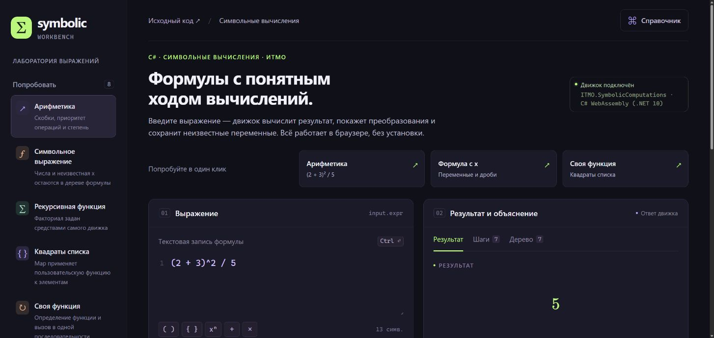

# Символьные вычисления на C# — учебный проект ИТМО

**Небольшой движок для работы с математическими выражениями.** Он читает формулу, строит из неё дерево операций и показывает результат и ход вычислений.

## Что это и зачем

Обычный калькулятор сразу считает числа. Здесь можно работать и с выражением, в котором остаётся неизвестная переменная: например, вычислить числовую часть формулы с `x`, представить результат в математической записи и посмотреть, из каких операций он состоит.

В браузерной лаборатории можно вводить выражения, вызывать функции, работать со списками, смотреть шаги вычисления и копировать запись LaTeX для документа. Визуализация дерева помогает понять, как программа разбирает формулу и в каком порядке её вычисляет.

## Предмет и учебная задача

**Тема учебного проекта — символьные вычисления; язык реализации — C#.** Задача — представить математическое выражение как структуру данных и реализовать его обработку: переменные, операции, функции, преобразования и рекурсивное вычисление.

Исходное ядро разработано в ИТМО в 2019 году Иваном Айгузиным и Савелием Масалкиным. Браузерная лаборатория, текстовый парсер, отображение LaTeX и обновление на .NET 10 добавлены в 2026 году. Проект демонстрирует устройство собственного вычислительного движка; полноценной заменой систем компьютерной алгебры он не заявлен.

**[Открыть интерактивное демо →](https://jakesmokie.github.io/ITMO.SymbolicComputations/lab/)**
· [Посмотреть фрактал](https://jakesmokie.github.io/ITMO.SymbolicComputations/lab/fractal.html)
· [Разобрать код за 5 минут](docs/REVIEW_GUIDE.md)

В демо автоматически вычисляется первый пример. Попробуйте кнопки «Арифметика»,
«Формула с x» и «Своя функция», затем откройте шаги или дерево выражения.
Установка и регистрация не нужны; при первом открытии загружается .NET WebAssembly.




[](https://github.com/JakeSmokie/ITMO.SymbolicComputations/actions/workflows/verify.yml)

**Быстро оценить проект:** [маршрут по коду и тестам](docs/REVIEW_GUIDE.md) · [локальный запуск](#запуск-браузерной-версии) · [результаты проверки](VALIDATION.md).

Учебное ядро написано в ИТМО в 2019 году Иваном Айгузиным (`JakeSmokie`) и Савелием Масалкиным (`savamas`). История сохраняет вклад обоих участников. Обновление 2026 года добавляет .NET 10, текстовый парсер, ограничения вычислений и браузерную лабораторию. Проект показывает работу с деревьями выражений, рекурсией, семантикой вычисления и тестированием. Коммерческий опыт backend-разработки описан отдельно в резюме.

| Что можно проверить | Где смотреть |
|---|---|
| Модель выражений и вычисление через посетителей | `Base/Models`, `Base/Visitors`, `SymbolicContext` |
| Приоритет операций и понятные ошибки ввода | Текстовый парсер и `ParserTests` |
| Ограничения рекурсии и объёма вычислений | `EvaluationBudget`, `EvaluationLimitsTests` |
| Корректное представление формул | `LatexFormatter`, `LatexFormatterTests`: приоритеты, экранирование и лимиты |
| Один движок для API и браузера | `WorkbenchService`, хост ASP.NET Core и WebAssembly |
| Численная корректность визуализации | `MandelbrotTests`: сравнение с `System.Numerics.Complex` |

Сокращённые пути в таблице раскрыты прямыми ссылками в [руководстве по коду](docs/REVIEW_GUIDE.md). Локальная проверка 8 октября 2026: 215 тестов, без ошибок и пропусков; текущий статус коммита показывает CI.

**English:** an ITMO university project with a C# symbolic expression engine, a text parser, bounded evaluation and a WebAssembly workbench. The 2019 coursework and the 2026 modernization are distinguished in the repository history. [Code review guide](docs/REVIEW_GUIDE.md).

## Что можно делать

- Вводить арифметику, переменные и функции текстом: `(2 + 3)^2 / 5`, `Factorial(5)`, `Map({1,2,3})(Fun(x,x^2))`.
- Смотреть формулы в математической записи LaTeX, последовательность преобразований и дерево исходного выражения.
- Копировать LaTeX результата для документа или заметки; дроби, степени и группировка строятся из настоящего дерева выражения.
- Выбирать готовые примеры, искать функции в справочнике, копировать результат и экспортировать ответ в JSON.
- Возвращаться к недавним выражениям на этом устройстве; история хранится только в браузере.
- Исследовать множество Мандельброта: приближать карту, выбирать комплексную точку и видеть её орбиту с вычисленными формулами.

## Множество Мандельброта

Страница `/lab/fractal.html` визуализирует итерацию `z[n+1] = z[n]^2 + c`, начиная с `z[0] = 0`. Для `z = x + iy` используются две действительные формулы:

```text
x[n+1] = x[n]^2 - y[n]^2 + Re(c)
y[n+1] = 2*x[n]*y[n] + Im(c)
```

Карта считается оптимизированным циклом C# с числами double, скомпилированным в тот же WebAssembly. Для выбранной точки эти формулы проходят через настоящий текстовый парсер и `SymbolicContext`; в таблице показаны значения и выражения из движка. Символьный движок не вызывается для каждого пикселя: это сделало бы интерактивное исследование слишком медленным.

Цвет означает скорость выхода за `|z| > 2`; тёмный пиксель означает лишь, что выход не найден за заданное число итераций. Это конечное численное приближение, а не доказательство принадлежности множеству. При глубоком увеличении важны точность double и предел количества итераций.

Контрольный пример `c = 1`: `z = 0, 1, 2, 5`, первый выход за радиус 2 — на третьем шаге. При `c = -1` орбита чередует `0` и `-1`. Эти случаи полезны для проверки связи формулы и картинки.

Имена чувствительны к регистру. Есть вызовы `Name(...)` и `Name[...]`, цепочки вызовов и списки `{...}`. Для умножения нужен `*`. Неизвестные символы остаются символами. Движок не является полным CAS: раскрытие скобок, общее приведение подобных и точная рациональная арифметика не обещаются. Например, `Plus(x,2,3)` сохраняет символьную структуру. `Power` и `Sin` используют double внутри вычислений, остальные числа представлены decimal.

## Запуск браузерной версии

Нужен .NET SDK 10; версия и roll-forward указаны в `global.json`. Для обычной сборки не нужны AOT, Node.js и установка wasm-tools.

```powershell
./Build-Browser.ps1
python -m http.server 5188 --bind 127.0.0.1 --directory artifacts/browser-site
```

Открыть `http://127.0.0.1:5188/lab/`. Для размещения скопировать содержимое `artifacts/browser-site` в HTTP-корень сайта. Приложение настроено на путь `/lab/`. Открытие `index.html` через `file://` не поддерживается. После загрузки WASM вычисления выполняются в браузере; внешний API для формул не нужен.

`Build-Browser.ps1 -Destination <каталог>` также позволяет собрать лабораторию в существующий статический сайт. Переписываются файлы подкаталога `lab`, прочие разделы остаются на месте.

Для размещения в подпапке укажите абсолютный путь от корня сайта, например `./Build-Browser.ps1 -BasePath /ITMO.SymbolicComputations/lab/`. Скрипт применяет его ко всем HTML-страницам лаборатории. Корневой `index.html` создаётся только при его отсутствии.

## API и исходники

`ITMO.SymbolicComputations.Workbench` — общий сервис для браузера и сохранённого ASP.NET-хоста. `ITMO.SymbolicComputations.Browser` загружает его в WebAssembly. `ITMO.SymbolicComputations.Web/wwwroot` содержит интерфейс на HTML/CSS/JavaScript и локальную копию KaTeX 0.19.0 для отображения формул ([лицензия и происхождение](THIRD_PARTY_NOTICES.md)).

```csharp
var input = SymbolicParser.Parse("Map({1,2,3})(Fun(x,x^2))");
var (steps, result) = new SymbolicContext().Run(input, new EvaluationOptions());
```

При необходимости исходный веб-проект можно запустить отдельно:

```powershell
dotnet run --project ITMO.SymbolicComputations.Web --no-launch-profile
```

Он слушает loopback `http://127.0.0.1:5187`; REST `POST /api/evaluate` принимает `{"expression":"1+2"}`. Ответ содержит `inputLatex`, `resultLatex` и `stepsLatex` вместе с текстовым результатом и деревом. LaTeX — формат вывода; вводить нужно обычную формулу. XML-маршрут `/api/compute` сохранён. Это локальный дополнительный вариант; опубликованная лаборатория работает через WebAssembly.

## Корректность и ограничения

Исправлены деление на ноль, структурный хеш выражений, область определения факториала/степени и совместимость ApplyList с FastMap. Добавлены позиционные ошибки парсера и общие лимиты на рекурсивный обход. Исчерпание итераций теперь является ошибкой, а не строкой, выдаваемой за ответ.

Лаборатория ограничивает запрос: 16 384 символа, глубина парсера 64, 4 096 созданных узлов; вычисление — глубина 192, 200 000 посещений узлов, 20 000 промежуточных шагов, 512 элементов списка и 3 секунды. История ответа ограничена 256 шагами и 200 000 символов суммарно для текста и LaTeX; усечение явно отмечается. Небольшой запрос может исчерпать бюджет, если вызывает много внутренних преобразований.

WASM исполняется в основном потоке браузера: сложная формула может временно задержать интерфейс до срабатывания лимита. Это не процессная изоляция и не гарантия точного wall-clock deadline. Отмена из UI игнорирует устаревший ответ, но не прерывает синхронное вычисление посередине. Для браузерной версии нет фонового сервера и требований держать компьютер разработчика включённым.

## Проверка

```powershell
dotnet test ITMO.SymbolicComputations.sln --disable-build-servers -m:1
```

Проверки охватывают прежние тесты, синтаксис/приоритет операций, выполнение примеров, ошибки и ограничения. Итог конкретного проверенного снимка записан в `VALIDATION.md`.

Техническая основа браузерного размещения: [официальная документация Blazor WebAssembly](https://learn.microsoft.com/aspnet/core/blazor/host-and-deploy/webassembly?view=aspnetcore-10.0).
